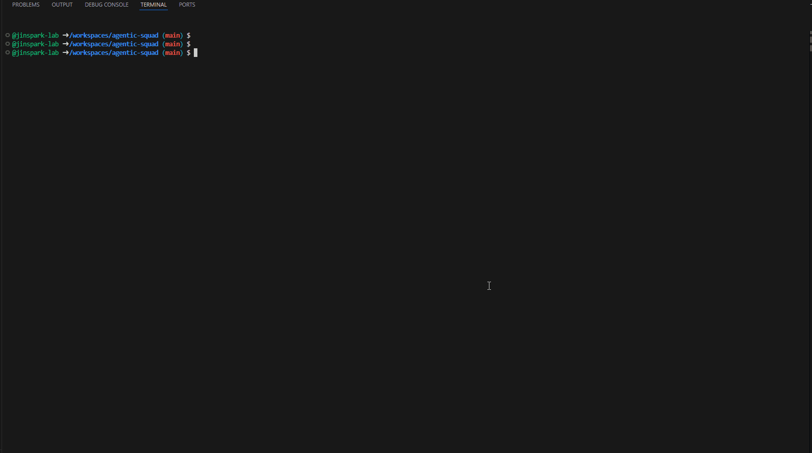

# 🤖 Agentic Squad

<p align="center">
  
</p>

> Squad CLI + GitHub Copilot CLI를 활용한 **멀티 에이전트 협업 패턴** 레퍼런스 프로젝트

여러 AI 에이전트가 역할을 분담하여 협업하는 패턴들을 정의하고, [GitHub Copilot CLI](https://docs.github.com/copilot)의 `--agent` 옵션으로 바로 실행할 수 있는 샘플을 제공합니다.

## 프로젝트 구조

```
agentic-squad/
├── AGENTS.md                           # 모든 에이전트 공통 가드레일 (Harness)
├── init.sh                             # Codespace 환경 셋업 스크립트
├── .devcontainer/
│   └── devcontainer.json               # Codespace 시작 시 init.sh 자동 실행
├── .github/agents/                     # Copilot CLI 에이전트 정의
│   ├── orchestrator.agent.md           # 오케스트레이터 — 요청 분석 후 패턴 자동 선택
│   ├── planner_executor.agent.md       # 계획-실행 패턴 에이전트
│   ├── debate_critic.agent.md          # 토론-비평 패턴 에이전트
│   ├── generator_evaluator.agent.md    # 생성-평가 패턴 에이전트
│   ├── leadership.agent.md             # 리더십 토론 패턴 에이전트
│   └── squad.agent.md                  # Squad 기본 팀 에이전트
├── .github/skills/                     # Agent Skills — 에이전트 공유 스킬
│   └── session-state-management/       # 세션 상태 관리 스킬
│       └── SKILL.md
├── .squad/                             # Squad 팀 상태 (team, decisions, agents 등)
│   └── patterns/                       # 패턴 세션 상태 관리
│       ├── state.json                  # 활성 세션 인덱스
│       └── history/                    # 세션별 진행 기록
├── project/                            # 프로젝트별 컨텍스트 및 결과물
│   └── {topic}/                        # 프로젝트 주제 디렉토리
│       ├── story/                      # 📖 프로젝트 배경·현황 (에이전트 입력)
│       │   └── story.md                # 메인 스토리
│       └── result/                     # 📝 에이전트 작업 결과물 (에이전트 출력)
│           └── {pattern}-{date}/       # 패턴별·날짜별 산출물
└── patterns/                           # 멀티 에이전트 협업 패턴 정의
    ├── debate_critic/                  # 변증법적 토론 패턴
    ├── generator_evaluator/            # 생성-평가 반복 패턴
    ├── leadership/                     # 리더십 토론 패턴
    └── planner_executor/               # 계획-실행 분리 패턴
```

## 시작하기

### 사전 요구 사항

- [GitHub Codespaces](https://github.com/features/codespaces) 또는 Node.js 22+ 환경
- [GitHub Copilot](https://github.com/features/copilot) 구독

### 방법 1: Codespace (권장)

이 레포를 Codespace로 열면 `init.sh`가 자동 실행되어 아래 도구들이 설치됩니다:

| 도구 | 설명 |
|------|------|
| [GitHub Copilot CLI](https://docs.github.com/copilot) | `copilot` 명령으로 에이전트 실행 |
| [Azure CLI](https://learn.microsoft.com/cli/azure/) | Azure 리소스 관리 |
| [Squad CLI](https://github.com/bradygaster/squad) | AI 에이전트 팀 관리 |
| [uv](https://docs.astral.sh/uv/) | Python 패키지 매니저 |

### 방법 2: 로컬 환경

```bash
git clone https://github.com/<owner>/agentic-squad.git
cd agentic-squad
./init.sh
```

## 에이전트 실행 방법

### Copilot CLI로 에이전트 실행

```bash
# 오케스트레이터 — 요청을 분석하여 최적의 패턴 팀을 자동 선택
copilot --agent orchestrator --yolo

# 개별 패턴 에이전트를 직접 지정하여 실행
copilot --agent planner_executor --yolo
copilot --agent debate_critic --yolo
copilot --agent generator_evaluator --yolo
copilot --agent leadership --yolo

# Squad 기본 팀 (Morpheus, Oracle, Neo, Trinity 등)
copilot --agent squad --yolo

# 기본 Copilot CLI (에이전트 없이)
copilot
```

### Squad 대화형 쉘

```bash
squad              # 인터랙티브 모드 진입
squad status       # 팀 상태 확인
squad doctor       # 설정 검증
```

---

## 에이전트 패턴

### 🎯 Orchestrator (오케스트레이터)

> 사용자 요청을 분석하고 최적의 패턴 팀을 자동 선택하는 라우터

```bash
copilot --agent orchestrator --yolo
```

Orchestrator는 프롬프트의 의도를 분석하여 아래 네 패턴 중 하나를 선택합니다:

| 사용자 의도 | 선택 패턴 |
|------------|----------|
| "구현해줘", "셋업해줘", "마이그레이션" | 📐 Planner-Executor |
| "비교해줘", "장단점", "뭐가 나을까" | ⚔️ Debate & Critic |
| "생성해줘", "리뷰해줘", "개선해줘" | ⚡ Generator-Evaluator |
| "전략 논의", "경영진 회의", "C-Level" | 🏛️ Leadership |

#### 📖 Context Routing (선택 기능)

`project/` 디렉토리에 프로젝트 컨텍스트가 준비되어 있으면, Orchestrator가 자동으로 감지하여 에이전트에게 주입합니다. **프로젝트가 없으면 CLI 내에서만 결과를 반환**하므로 별도 설정 없이 바로 사용할 수 있습니다.

| 조건 | 동작 |
|------|------|
| `project/` 매칭 없음 | CLI 내부에서만 결과 반환 (파일 저장 없음) |
| 프로젝트 있음 + `story/story.md` 있음 | story 읽어서 에이전트에 주입 + `result/`에 저장 |
| 프로젝트 있음 + story 없음 | story 없이 진행 + `result/`에 저장 |

```
project/{topic}/
├── story/story.md          # (선택) 프로젝트 배경·현황
└── result/{pattern}-{date}/ # 에이전트 산출물 자동 저장
```

---

### 🧩 Agent Teams 개념

**Agent Team**은 하나의 작업을 여러 전문 에이전트가 **역할을 분담**하여 협업으로 수행하는 단위입니다. 단일 에이전트가 모든 것을 처리하는 것이 아니라, 각 에이전트가 고유한 역할과 목표를 가지고 **대화 → 판단 → 반복** 루프를 형성합니다.

```
┌─────────────────────────────────────────────────┐
│                  Agent Team                     │
│                                                 │
│   ┌──────────┐   ┌──────────┐   ┌──────────┐   │
│   │ Role A   │──▶│ Role B   │──▶│ Role C   │   │
│   │ (생성/제안)│   │ (평가/반론)│   │ (종합/기록)│   │
│   └──────────┘   └──────────┘   └──────────┘   │
│        ▲                              │         │
│        └──────── 피드백 루프 ──────────┘         │
└─────────────────────────────────────────────────┘
```

#### 핵심 원칙

| 원칙 | 설명 |
|------|------|
| **역할 분리** | 각 에이전트는 하나의 명확한 책임만 수행한다 (예: Generator는 생성만, Evaluator는 평가만) |
| **피드백 루프** | 산출물 → 평가 → 개선의 반복을 통해 품질을 점진적으로 높인다 |
| **수렴 조건** | 무한 반복을 방지하기 위해 각 패턴에 최대 반복 횟수(Round/Cycle)를 설정한다 |
| **Scribe 기록** | 모든 팀에는 Scribe가 포함되어 과정과 결과를 문서로 남긴다 |
| **공통 가드레일** | [`AGENTS.md`](AGENTS.md)를 통해 모든 팀에 동일한 안전 규칙이 적용된다 |

#### 패턴별 팀 비교

| | 📐 Planner-Executor | ⚔️ Debate & Critic | ⚡ Generator-Evaluator | 🏛️ Leadership |
|---|---|---|---|---|
| **목적** | 체계적 실행 | 최선의 결론 도출 | 반복 개선으로 품질 향상 | 전략적 의사결정 |
| **팀 구성** | Planner → Executor → Validator | Proposer ↔ Opponent → Critic → Synthesizer | Generator → Evaluator → Refiner | CEO → CTO/CISO/CFO/CPO → Cross-Review |
| **핵심 루프** | 계획 → 실행 → 검증 → (수정) | 제안 → 반론 → 평가 → (재논의) | 생성 → 평가 → 개선 → (재평가) | 안건 → 브리핑 → 교차검토 → 결정 |
| **최대 반복** | 계획 수정 후 재실행 | 3 Rounds | 3 Cycles | 2 Cross-Review Rounds |
| **적합한 작업** | 구현, 마이그레이션, 셋업 | 기술 선택, 아키텍처 비교 | 코드 생성, 문서 작성, 리뷰 | 기술 전략, 보안 정책, 투자 결정 |

---

### 📖 예시 시나리오

실제 개발 상황에서 Agent Team이 어떻게 작동하는지 세 가지 시나리오로 살펴봅니다.

#### 시나리오 1: "모노레포 vs 멀티레포, 우리 팀에 뭐가 맞을까?"

> **선택 패턴:** ⚔️ Debate & Critic

```
사용자 ──▶ Orchestrator ──▶ Debate & Critic 팀 선택
```

| 단계 | 에이전트 | 수행 내용 |
|------|---------|----------|
| Round 1 | **Proposer** | "모노레포를 채택해야 합니다. 코드 공유가 쉽고, CI/CD 파이프라인을 통합 관리할 수 있습니다." |
| | **Opponent** | "멀티레포가 낫습니다. 팀별 독립 배포가 가능하고, 저장소 크기가 작아 빌드가 빠릅니다." |
| | **Critic** | "Proposer의 CI 통합 주장은 강력하나, 팀 규모(5명)에서는 모노레포 관리 부담이 클 수 있습니다." |
| | **Synthesizer** | 아직 수렴 불가 — 팀 규모와 배포 빈도 기준으로 Round 2 진행 |
| Round 2 | **Proposer** | 팀 규모 5명에서도 Turborepo 도입으로 모노레포 관리 부담 최소화 가능 |
| | **Opponent** | Turborepo 러닝 커브와 종속성 복잡도 증가 리스크 제기 |
| | **Critic** | 양측 논증 균형 잡힘. 프로젝트 초기 단계에서는 모노레포가 유리 |
| | **Synthesizer** | ✅ **수렴** — "초기에는 모노레포 + Turborepo, 팀 10명 이상 시 분리 검토" 권고 |
| 최종 | **Scribe** | 논의 과정·근거·최종 권고안을 `decisions/monorepo-vs-multirepo.md`로 문서화 |

---

#### 시나리오 2: "사용자 인증 API를 만들어줘"

> **선택 패턴:** ⚡ Generator & Evaluator

```
사용자 ──▶ Orchestrator ──▶ Generator & Evaluator 팀 선택
```

| 단계 | 에이전트 | 수행 내용 |
|------|---------|----------|
| Cycle 1 | **Generator** | JWT 기반 인증 API 초안 생성 (`/auth/login`, `/auth/refresh`, `/auth/logout`) |
| | **Evaluator** | 평가: 보안 6/10 (토큰 만료 누락), 코드 품질 7/10 → ❌ **Fail** |
| | **Refiner** | 토큰 만료 시간 설정, refresh token rotation 추가, 입력 검증 강화 |
| Cycle 2 | **Evaluator** | 재평가: 보안 8/10 (rate limiting 미적용), 코드 품질 9/10 → ❌ **Fail** |
| | **Refiner** | express-rate-limit 미들웨어 적용, 로그인 시도 횟수 제한 추가 |
| Cycle 3 | **Evaluator** | 재평가: 보안 9/10, 코드 품질 9/10, 테스트 커버리지 85% → ✅ **Pass** |
| 최종 | **Scribe** | Cycle별 개선 이력과 최종 API 명세를 문서화 |

---

#### 시나리오 3: "결제 시스템 통합을 계획하고 실행해줘"

> **선택 패턴:** 📐 Planner & Executor

```
사용자 ──▶ Orchestrator ──▶ Planner & Executor 팀 선택
```

| 단계 | 에이전트 | 수행 내용 |
|------|---------|----------|
| 계획 | **Planner** | 태스크 분해: ① PG사 SDK 설치 → ② 결제 모델 정의 → ③ 결제 API 구현 → ④ 웹훅 핸들러 → ⑤ 통합 테스트 |
| 실행 1 | **Executor** | 태스크 ①②③ 순서대로 구현 |
| 검증 1 | **Validator** | ① ✅ Pass, ② ✅ Pass, ③ ❌ Revise — "환불 처리 로직 누락" |
| 수정 | **Planner** | 태스크 ③에 환불 엔드포인트 추가, 태스크 ④와의 의존성 재정의 |
| 실행 2 | **Executor** | 수정된 ③④⑤ 재구현 |
| 검증 2 | **Validator** | ③ ✅ Pass, ④ ✅ Pass, ⑤ ✅ Pass |
| 최종 | **Scribe** | 전체 계획·실행·검증 이력과 최종 산출물 목록을 문서화 |

---

#### 시나리오 4: "클라우드 마이그레이션 전략을 경영진 관점에서 논의해줘"

> **선택 패턴:** 🏛️ Leadership

```
사용자 ──▶ Orchestrator ──▶ Leadership 팀 선택
```

| 단계 | 에이전트 | 수행 내용 |
|------|---------|----------|
| 안건 설정 | **CEO** | "온프레미스 → 클라우드 마이그레이션 전략 결정" — 대상 시스템, 일정, 예산 범위 프레이밍 |
| 기술 브리핑 | **CTO** | 하이브리드 vs 풀 클라우드 비교, 마이크로서비스 전환 복잡도, 기술 팀 역량 분석 |
| 보안 브리핑 | **CISO** | 데이터 레지던시 규정, 클라우드 보안 아키텍처, 컴플라이언스(ISMS, GDPR) 검토 |
| 재무 브리핑 | **CFO** | TCO 비교(3년 기준), 마이그레이션 비용, OpEx 전환 효과, ROI 예측 |
| 제품 브리핑 | **CPO** | 서비스 중단 리스크, 사용자 경험 영향, 마이그레이션 중 기능 동결 기간 |
| 교차 검토 | **CEO** | CTO-CFO 간 비용 vs 기술 부채 충돌 식별, CISO-CPO 간 보안 vs UX 트레이드오프 질문 |
| 보충 답변 | **CTO, CFO** | 단계적 마이그레이션으로 비용 분산 가능성 합의 |
| 최종 결정 | **CEO** | ✅ "Phase 1: 비핵심 서비스 클라우드 이전 (3개월), Phase 2: 핵심 서비스 (6개월)" — Action Items 도출 |
| 문서화 | **Chief of Staff** | 전체 논의 과정, 각 임원 의견, 결정 근거, Action Items을 `decisions/cloud-migration.md`로 문서화 |

---

### 🗣️ Debate & Critic (변증법적 토론)

> 대립적 논증과 비평을 통해 최선의 결론에 도달하는 패턴

**패턴 상세:** [`patterns/debate_critic/README.md`](patterns/debate_critic/README.md)

```bash
copilot --agent debate_critic --yolo
```

#### 에이전트 구성

| 역할 | 설명 |
|------|------|
| **Proposer** | 설득력 있는 근거와 함께 입장 제시 |
| **Opponent** | Proposer 논증의 약점 지적 및 대안 제시 |
| **Critic** | 양측 논증의 강점/약점을 객관적으로 분석 |
| **Synthesizer** | 논의를 통합하여 실행 가능한 권고안 도출 |
| **Scribe** | 논의 과정과 결론을 문서화 |

#### 예시 프롬프트

```
REST API vs GraphQL 중 우리 프로젝트에 어떤 걸 쓸지 토론해줘
모노레포 vs 멀티레포 장단점을 분석해줘
```

#### 진행 흐름

1. **Proposer** → 입장 제시
2. **Opponent** → 반대 논증
3. **Critic** → 양측 평가
4. **Synthesizer** → 종합 및 수렴 판단
5. 수렴하지 않으면 → 다음 Round (최대 3회)
6. 수렴 시 → **Scribe** 문서화

---

### 🔄 Generator & Evaluator (생성-평가 반복)

> 생성과 평가를 분리하여 반복 개선으로 품질을 높이는 패턴

**패턴 상세:** [`patterns/generator_evaluator/README.md`](patterns/generator_evaluator/README.md)

```bash
copilot --agent generator_evaluator --yolo
```

#### 에이전트 구성

| 역할 | 설명 |
|------|------|
| **Generator** | 요구사항을 분석하여 초안(코드·문서·설계)을 생성 |
| **Evaluator** | 기준표에 따라 산출물을 평가·채점하고 개선점 제시 |
| **Refiner** | Evaluator 피드백을 반영하여 산출물을 개선 |
| **Scribe** | Cycle별 변경 이력과 최종 결과를 기록 |

#### 예시 프롬프트

```
사용자 인증 API 코드를 생성하고 리뷰해줘
CI/CD 파이프라인 설정을 생성하고 검증해줘
```

#### 진행 흐름

1. **Generator** → 초안 생성
2. **Evaluator** → 평가·채점 (Pass/Fail)
3. Fail → **Refiner** 개선 → 재평가 (최대 3 Cycles)
4. Pass → **Scribe** 문서화

---

### 📋 Planner & Executor (계획-실행 분리)

> 계획 수립과 실행을 분리하여 체계적으로 작업을 완수하는 패턴

**패턴 상세:** [`patterns/planner_executor/README.md`](patterns/planner_executor/README.md)

```bash
copilot --agent planner_executor --yolo
```

#### 에이전트 구성

| 역할 | 설명 |
|------|------|
| **Planner** | 요구사항을 분석하고 태스크·의존성·순서를 포함한 실행 계획 수립 |
| **Executor** | 계획에 따라 태스크를 순서대로 구현 |
| **Validator** | 각 태스크의 완료 기준 충족 여부를 검증 |
| **Scribe** | 계획·실행·검증 과정 전체를 기록 |

#### 예시 프롬프트

```
결제 시스템 통합을 계획하고 실행해줘
레거시 API를 v2로 마이그레이션 계획 세워줘
```

#### 진행 흐름

1. **Planner** → 태스크 목록·의존성·완료 기준 수립
2. **Executor** → 태스크 순서대로 구현
3. **Validator** → Pass/Revise 판정
4. Revise → **Planner** 계획 수정 후 재실행
5. 모든 Pass → **Scribe** 문서화

---

### 🏛️ Leadership (경영진 토론)

> C-Level 경영진이 각자의 도메인 전문성으로 안건을 논의하고 전략적 의사결정을 내리는 패턴

**패턴 상세:** [`patterns/leadership/README.md`](patterns/leadership/README.md)

```bash
copilot --agent leadership --yolo
```

#### 에이전트 구성

| 역할 | 설명 |
|------|------|
| **CEO** | 최고경영자 — 안건 설정, 논의 조율, 최종 의사결정 |
| **CTO** | 최고기술책임자 — 기술 전략, 아키텍처, 엔지니어링 관점 분석 |
| **CISO** | 최고정보보안책임자 — 보안, 컴플라이언스, 리스크 관리 관점 분석 |
| **CFO** | 최고재무책임자 — 재무 영향, 비용 분석, ROI 관점 분석 |
| **CPO** | 최고제품책임자 — 제품 전략, 사용자 경험, 시장 적합성 관점 분석 |
| **Chief of Staff** | 비서실장 — 논의 과정과 최종 의사결정을 기록·문서화 |

#### 예시 프롬프트

```
클라우드 마이그레이션 전략을 경영진 관점에서 논의해줘
AI 투자 우선순위를 결정해줘
보안 정책 강화 방안을 C-Level 회의로 검토해줘
```

#### 진행 흐름

1. **CEO** → 안건 설정 (논의 주제 정의, 맥락 설명)
2. **CTO** → 기술 관점 브리핑
3. **CISO** → 보안 관점 브리핑
4. **CFO** → 재무 관점 브리핑
5. **CPO** → 제품 관점 브리핑
6. **CEO** → 교차 검토 (충돌·갈등 지점 식별, 교차 질문)
7. 해당 **C-Level** → 보충 답변 및 입장 조율
8. 수렴하지 않으면 → Cross-Review Round 2 (최대 2회)
9. **CEO** → 최종 의사결정 + Action Items 도출
10. **Chief of Staff** → 전체 논의 과정·결정·Action Items 문서화

---

## 세션 기반 상태 관리

에이전트 패턴은 **파일 기반 세션 상태 관리**를 통해 진행 상황을 보존합니다. 세션이 중단되더라도 이전 상태에서 이어서 작업할 수 있습니다.

### 상태 저장 구조

```
.squad/patterns/
├── state.json                          # 활성 세션 인덱스
└── history/                            # 세션별 진행 기록
    └── {session-id}/
        ├── meta.json                   # 세션 메타데이터 (패턴, 시작시간, 상태)
        ├── progress.json               # 진행 상황 (패턴별 Phase/Round/Cycle)
        ├── agents/                     # 에이전트별 산출물
        │   ├── ceo.md
        │   ├── cto.md
        │   └── ...
        └── summary.md                  # 최종 요약 (완료 시)
```

### 패턴별 진행 추적

| 패턴 | 추적 단위 | 주요 필드 |
|------|----------|----------|
| 📐 Planner-Executor | Phase (planning → execution → validation) | `currentPhase`, `revisionCount`, 태스크별 상태 |
| ⚔️ Debate & Critic | Round (최대 3회) | `currentRound`, 에이전트별 완료 여부, `converged` |
| ⚡ Generator-Evaluator | Cycle (최대 3회) | `currentCycle`, Cycle별 `verdict`, `scores` |
| 🏛️ Leadership | Phase (agenda → briefing → cross-review → decision) | `currentPhase`, 브리핑 완료 여부, `crossReviewRound` |

### 세션 라이프사이클

1. **Init** — 에이전트 시작 시 `state.json`을 확인하여 미완료 세션이 있으면 이어서 진행
2. **Step** — 각 단계(Phase/Round/Cycle) 완료 시 `progress.json`을 갱신
3. **Complete** — 모든 단계 완료 시 `summary.md` 작성, `state.json`에서 세션을 `history`로 이동

---

## Agent Skills

[Agent Skills](https://docs.github.com/en/copilot/concepts/agents/about-agent-skills)는 Copilot CLI가 특정 작업에 필요한 지식을 자동으로 로드하는 **재사용 가능한 지침 묶음**입니다. `.github/skills/{skill-name}/SKILL.md` 형식으로 정의하면 Copilot CLI가 자동 인식합니다.

### 내장 스킬

| 스킬 | 경로 | 설명 |
|------|------|------|
| `session-state-management` | `.github/skills/session-state-management/` | 파일 기반 세션 상태 관리 라이프사이클 |

모든 패턴 에이전트(`debate_critic`, `generator_evaluator`, `planner_executor`, `leadership`)가 이 스킬을 참조하여 세션 상태를 영속화합니다. 각 에이전트에는 패턴 고유 설정(progress schema, 파일명 규칙, step 로직)만 남기고, 공통 라이프사이클은 스킬에 위임합니다.

### 커스텀 스킬 추가하기

에이전트 팀에 반복적으로 필요한 지식이 있다면 Agent Skill로 분리하여 최적화할 수 있습니다.

1. `.github/skills/{skill-name}/` 디렉토리를 생성합니다
2. `SKILL.md` 를 작성합니다 (YAML frontmatter + Markdown 본문):
   ```markdown
   ---
   name: my-custom-skill
   description: "이 스킬의 용도와 언제 사용해야 하는지 설명"
   ---

   # 스킬 내용
   에이전트가 따라야 할 지침...
   ```
3. 에이전트에서 `/my-custom-skill` 로 명시 호출하거나, `description` 매칭으로 자동 주입됩니다

#### 스킬로 분리하면 좋은 예시

| 후보 스킬 | 용도 |
|-----------|------|
| `code-review-checklist` | 모든 패턴에서 코드 리뷰 시 공통 체크리스트 |
| `git-workflow` | 브랜치 네이밍, 커밋 컨벤션, PR 생성 규칙 |
| `testing-standards` | 테스트 커버리지 기준, 테스트 파일 구조 규칙 |
| `security-review` | OWASP 기반 보안 검토 체크리스트 |

> 자세한 스킬 작성법은 [GitHub 공식 문서](https://docs.github.com/en/copilot/how-tos/copilot-cli/customize-copilot/create-skills)를 참고하세요.

---

## 가드레일 (AGENTS.md)

모든 에이전트는 [`AGENTS.md`](AGENTS.md)에 정의된 Harness Rules를 준수합니다:

- 🔴 **`git push` 절대 금지** — 모든 원격 반영은 `gh pr create --draft`를 통한 PR 기반 워크플로우로 진행
- 코드가 원격 저장소에 반영되기 전 반드시 사람의 검토를 거침

## 라이선스

이 프로젝트의 라이선스 정보는 레포지토리 설정을 확인하세요.
