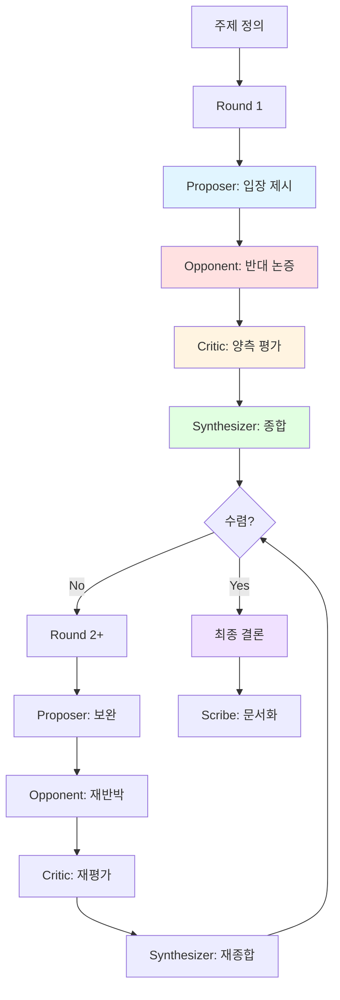

# Debate & Critic Pattern

> 대립적 논증과 비평을 통해 최선의 결론에 도달하는 에이전트 협업 패턴

## 패턴 소개

두 명의 Debater(Proposer/Opponent)가 서로 다른 입장에서 논증하고, Critic이 중립적으로 평가하며, Synthesizer가 최종 결론을 도출하는 변증법적 의사결정 패턴입니다. 아키텍처 선택, 기술 스택 비교 등 트레이드오프가 명확한 주제에 적합합니다.

## 에이전트 구성

| 역할 | 설명 |
|------|------|
| **Proposer** | 특정 입장을 제안하고 근거를 들어 옹호 |
| **Opponent** | 반대 입장에서 논증하고 약점을 지적 |
| **Critic** | 양측 논증을 중립적으로 평가·분석 |
| **Synthesizer** | 논의를 종합하여 최종 결론·권고 도출 |
| **Scribe** | 전체 논의 과정을 기록·요약 |

## 파일 셋업

이 패턴을 프로젝트에 적용하려면 아래 파일들을 구성하세요.

### 1. `AGENTS.md` (프로젝트 루트)

루트 AGENTS.md에 전체 에이전트 공통 규칙(Harness)을 정의합니다. 이미 존재하면 그대로 사용하세요.

### 2. `.squad/team.md`

`team.md` 템플릿을 복사하여 `.squad/team.md`로 사용합니다:

```markdown
# Debate Team

## Proposer
- 역할: 찬성/제안 측 논증 담당
- 목표: 설득력 있는 근거와 함께 입장 제시

## Opponent
- 역할: 반대/대안 측 논증 담당
- 목표: Proposer 논증의 약점 지적 및 대안 제시

## Critic
- 역할: 중립 평가자
- 목표: 양측 논증의 강점/약점을 객관적으로 분석

## Synthesizer
- 역할: 종합·결론 담당
- 목표: 논의를 통합하여 실행 가능한 권고안 도출

## Scribe
- 역할: 기록자
- 목표: 논의 과정과 결론을 문서화
```

### 3. `.squad/routing.md`

```markdown
# Routing: Round 기반 순차 진행

1. Proposer → 입장 제시
2. Opponent → 반대 논증
3. Critic → 양측 평가
4. Synthesizer → 종합 및 수렴 판단
5. 수렴하지 않으면 → Round 2로 반복 (최대 3 Rounds)
6. 수렴 시 → Scribe가 최종 문서화
```

## 실행 방법

### Step 1: Squad에 토론 요청

```
Squad, {주제}에 대해 debate 해줘
```

### Step 2: Round 흐름

각 Round는 아래 순서로 진행됩니다:

1. **Proposer** — 입장 제시 (또는 이전 Round 반박에 대한 보완)
2. **Opponent** — 반대 논증 및 약점 지적
3. **Critic** — 양측 논증의 강점·약점 평가
4. **Synthesizer** — 현재까지 논의 종합, 수렴 여부 판단

### Step 3: 수렴 조건

- 한쪽의 명확한 우위가 드러난 경우
- 양측이 핵심 트레이드오프에 합의한 경우
- 최대 Round(기본 3회)에 도달한 경우

수렴 시 **Scribe**가 최종 결론과 논의 과정을 문서화합니다.

## 실행 예시 프롬프트

```
Team, REST API vs GraphQL 중 우리 프로젝트에 어떤 걸 쓸지 논의해줘
```

```
Team, 모노레포 vs 멀티레포 장단점을 토론해줘
```

```
Team, PostgreSQL vs MongoDB — 우리 서비스 데이터 특성에 맞는 DB를 골라줘
```

## 패턴 다이어그램


