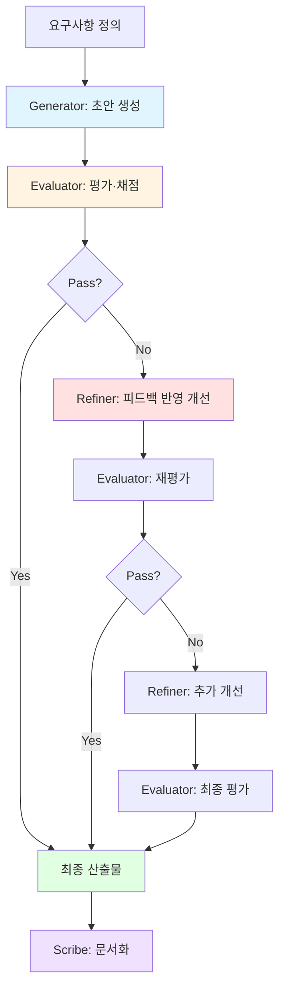

# Generator & Evaluator Pattern

> 생성과 평가를 분리하여 반복 개선으로 품질을 높이는 에이전트 협업 패턴

## 패턴 소개

Generator가 콘텐츠·코드·솔루션을 생성하고, Evaluator가 기준에 따라 평가·채점하며, Refiner가 피드백을 반영해 개선하는 순환 패턴입니다. 평가를 통과할 때까지 Cycle을 반복하여 품질 임계값을 충족시킵니다. 코드 생성 & 리뷰, 문서 작성 & 검토, 테스트 케이스 생성, 디자인 시안 평가 등에 적합합니다.

## 에이전트 구성

| 역할 | 설명 |
|------|------|
| **Generator** | 요구사항을 분석하여 초안(코드·문서·설계)을 생성 |
| **Evaluator** | 기준표에 따라 산출물을 평가·채점하고 개선점 제시 |
| **Refiner** | Evaluator 피드백을 반영하여 산출물을 구체적으로 개선 |
| **Scribe** | 각 Cycle의 변경 이력과 최종 결과를 기록·요약 |

## 파일 셋업

이 패턴을 프로젝트에 적용하려면 아래 파일들을 구성하세요.

### 1. `AGENTS.md` (프로젝트 루트)

루트 AGENTS.md에 전체 에이전트 공통 규칙(Harness)을 정의합니다. 이미 존재하면 그대로 사용하세요.

### 2. `.squad/team.md`

`team.md` 템플릿을 복사하여 `.squad/team.md`로 사용합니다:

```markdown
# Generator-Evaluator Team

## Generator
- 역할: 콘텐츠·코드·솔루션 생성
- 목표: 요구사항을 충족하는 초안을 빠르게 산출

## Evaluator
- 역할: 품질 평가·채점
- 목표: 기준표에 따라 산출물을 객관적으로 평가하고 개선점 도출

## Refiner
- 역할: 피드백 기반 개선
- 목표: Evaluator 피드백을 반영하여 산출물 품질 향상

## Scribe
- 역할: 기록자
- 목표: Cycle별 변경 사항과 최종 결과를 문서화
```

### 3. `.squad/routing.md`

```markdown
# Routing: Generate-Evaluate-Refine Cycle

1. Generator → 초안 생성
2. Evaluator → 기준표 기반 평가 (Pass/Fail 판정)
3. Pass → Scribe가 최종 문서화
4. Fail → Refiner가 피드백 반영하여 개선
5. 개선된 산출물 → Evaluator 재평가 (최대 3 Cycles)
6. 최대 Cycle 도달 시 → 현재 최선 결과로 Scribe가 문서화
```

## 실행 방법

### Step 1: Squad에 생성 요청

```
Squad, {주제}를 생성하고 평가해줘
```

### Step 2: Cycle 흐름

각 Cycle은 아래 순서로 진행됩니다:

1. **Generator** — 요구사항 분석 후 초안 생성 (또는 이전 Cycle 산출물 참고)
2. **Evaluator** — 기준표에 따라 평가·채점, Pass/Fail 판정
3. **Refiner** — Fail 시 피드백을 반영하여 산출물 개선

### Step 3: 통과 조건

- Evaluator가 모든 평가 기준을 충족한다고 판정한 경우 (Pass)
- 최대 Cycle(기본 3회)에 도달한 경우

통과 시 **Scribe**가 최종 산출물과 Cycle별 개선 이력을 문서화합니다.

## 실행 예시 프롬프트

```
Team, 사용자 인증 API 코드를 생성하고 리뷰해줘
```

```
Team, 제품 소개 랜딩페이지 카피를 작성하고 평가해줘
```

```
Team, CI/CD 파이프라인 설정을 생성하고 검증해줘
```

## 패턴 다이어그램


