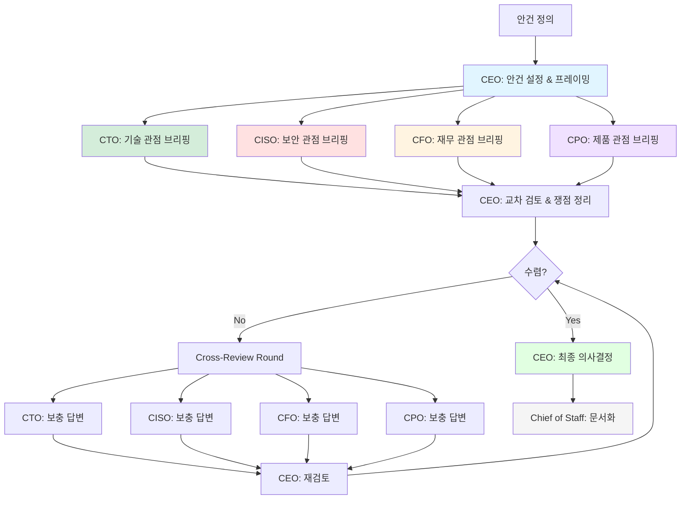

# Leadership Pattern

> C-Level 경영진이 각자의 도메인 전문성으로 안건을 논의하고 전략적 의사결정을 내리는 에이전트 협업 패턴

## 패턴 소개

CEO가 안건을 설정하면 CTO·CISO·CFO·CPO가 각자의 도메인(기술·보안·재무·제품) 관점에서 분석하고, 교차 검토를 거쳐 CEO가 최종 의사결정을 내리는 경영진 회의(Board Meeting) 시뮬레이션 패턴입니다. 기술 전략 수립, 보안 정책 결정, 투자 우선순위 결정, 제품 로드맵 검토 등 다중 도메인의 이해관계가 얽힌 전략적 의사결정에 적합합니다.

## 에이전트 구성

| 역할 | 설명 |
|------|------|
| **CEO** | 안건 설정, 논의 조율, 최종 의사결정 |
| **CTO** | 기술 전략, 아키텍처, 기술 부채, 엔지니어링 관점 분석 |
| **CISO** | 보안, 컴플라이언스, 리스크 관리, 데이터 보호 관점 분석 |
| **CFO** | 재무 영향, 비용 분석, ROI, 예산 관점 분석 |
| **CPO** | 제품 전략, 사용자 경험, 시장 적합성, 로드맵 관점 분석 |
| **Chief of Staff** | 논의 과정과 최종 의사결정을 기록·문서화 |

## 파일 셋업

이 패턴을 프로젝트에 적용하려면 아래 파일들을 구성하세요.

### 1. `AGENTS.md` (프로젝트 루트)

루트 AGENTS.md에 전체 에이전트 공통 규칙(Harness)을 정의합니다. 이미 존재하면 그대로 사용하세요.

### 2. `.squad/team.md`

`team.md` 템플릿을 복사하여 `.squad/team.md`로 사용합니다:

```markdown
# Leadership Team

## CEO
- 역할: 최고경영자 — 안건 설정 및 최종 의사결정
- 목표: 각 C-Level의 도메인 분석을 종합하여 전략적 방향 결정

## CTO
- 역할: 최고기술책임자 — 기술 전략 및 아키텍처
- 목표: 기술적 실현 가능성, 확장성, 기술 부채 관점에서 분석

## CISO
- 역할: 최고정보보안책임자 — 보안 및 컴플라이언스
- 목표: 보안 리스크, 규제 준수, 데이터 보호 관점에서 분석

## CFO
- 역할: 최고재무책임자 — 재무 및 투자
- 목표: 비용 효율성, ROI, 예산 영향, 재무 리스크 관점에서 분석

## CPO
- 역할: 최고제품책임자 — 제품 전략 및 사용자 경험
- 목표: 사용자 가치, 시장 경쟁력, 제품 로드맵 관점에서 분석

## Chief of Staff
- 역할: 비서실장 — 기록 및 문서화
- 목표: 논의 과정, 각 임원의 의견, 최종 의사결정을 체계적으로 문서화
```

### 3. `.squad/routing.md`

```markdown
# Routing: Board Meeting 방식 (Agenda → Briefing → Cross-Review → Decision)

1. CEO → 안건 설정 및 논의 프레이밍
2. CTO → 기술 관점 브리핑
3. CISO → 보안 관점 브리핑
4. CFO → 재무 관점 브리핑
5. CPO → 제품 관점 브리핑
6. CEO → 교차 검토 질문 및 쟁점 정리
7. 각 C-Level → 교차 검토에 대한 응답 (최대 2 Rounds)
8. CEO → 최종 의사결정 및 Action Items 도출
9. Chief of Staff → 전체 논의 과정 및 결론 문서화
```

## 실행 방법

### Step 1: Squad에 전략 논의 요청

```
Squad, {주제}에 대해 경영진 회의를 열어줘
```

### Step 2: Board Meeting 흐름

각 회의는 아래 순서로 진행됩니다:

#### Phase 1: Agenda Setting (안건 설정)
1. **CEO** — 논의 주제를 정의하고 맥락을 설명. 어떤 의사결정이 필요한지 프레이밍

#### Phase 2: Domain Briefing (도메인 브리핑)
2. **CTO** — 기술적 실현 가능성, 아키텍처 영향, 엔지니어링 리소스 관점 분석
3. **CISO** — 보안 위협, 컴플라이언스 요구사항, 리스크 매트릭스 관점 분석
4. **CFO** — 비용 구조, ROI 예측, 예산 영향, 재무 리스크 관점 분석
5. **CPO** — 사용자 가치, 시장 경쟁력, 제품 로드맵 정합성 관점 분석

#### Phase 3: Cross-Review (교차 검토)
6. **CEO** — 각 브리핑의 충돌·갈등 지점을 식별하고 교차 질문 제시
7. 해당 **C-Level** — 교차 질문에 대한 보충 답변 및 입장 조율

#### Phase 4: Decision (최종 결정)
8. **CEO** — 모든 관점을 종합하여 최종 의사결정 및 Action Items 도출
9. **Chief of Staff** — 논의 과정, 각 임원 의견, 최종 결정, Action Items 문서화

### Step 3: 수렴 조건

- 각 도메인의 핵심 우려사항이 충분히 검토된 경우
- CEO가 의사결정을 내릴 수 있는 충분한 정보가 수집된 경우
- 최대 Cross-Review Round(기본 2회)에 도달한 경우

수렴 시 **Chief of Staff**가 최종 의사결정과 Action Items를 문서화합니다.

## 실행 예시 프롬프트

```
Team, 클라우드 마이그레이션 전략에 대해 경영진 회의를 열어줘
```

```
Team, AI 도입 전략을 논의해줘 — 비용, 보안, 기술, 제품 관점 모두 검토해줘
```

```
Team, 내년 기술 투자 우선순위를 정해줘
```

```
Team, 제로 트러스트 보안 아키텍처 도입을 검토해줘
```

## 패턴 다이어그램



## 다른 패턴과의 차이점

| | 🏛️ Leadership | ⚔️ Debate & Critic | 📐 Planner-Executor |
|---|---|---|---|
| **목적** | 다중 도메인 전략적 의사결정 | 양자 대립적 최선안 도출 | 체계적 계획 및 실행 |
| **팀 구성** | CEO + CTO + CISO + CFO + CPO | Proposer ↔ Opponent → Critic | Planner → Executor → Validator |
| **핵심 루프** | 브리핑 → 교차 검토 → 결정 | 제안 → 반론 → 평가 → 종합 | 계획 → 실행 → 검증 |
| **관점 수** | 4개 도메인 (기술·보안·재무·제품) | 2개 (찬성·반대) | 1개 (실행 중심) |
| **적합한 작업** | 전략 수립, 투자 결정, 정책 검토 | 기술 선택, A vs B 비교 | 구현, 마이그레이션, 셋업 |
