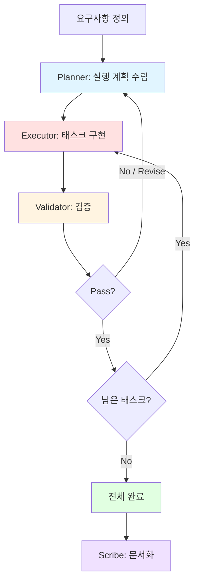

# Planner & Executor Pattern

> 계획 수립과 실행을 분리하여 체계적으로 작업을 완수하는 에이전트 협업 패턴

## 패턴 소개

Planner가 요구사항을 분석하여 구조화된 실행 계획(태스크, 의존성, 순서)을 수립하고, Executor가 태스크별로 구현하며, Validator가 각 태스크의 완료 기준 충족 여부를 검증하는 패턴입니다. 검증 실패 시 계획을 수정하여 재실행합니다. 복잡한 기능 구현, 마이그레이션 작업, 리팩토링 계획 & 실행, 프로젝트 초기 셋업에 적합합니다.

## 에이전트 구성

| 역할 | 설명 |
|------|------|
| **Planner** | 요구사항을 분석하고 태스크·의존성·순서를 포함한 실행 계획 수립 |
| **Executor** | 계획에 따라 태스크를 하나씩 구현·실행 |
| **Validator** | 각 태스크의 완료 기준(Acceptance Criteria) 충족 여부를 검증 |
| **Scribe** | 계획·실행·검증 과정 전체를 기록·요약 |

## 파일 셋업

이 패턴을 프로젝트에 적용하려면 아래 파일들을 구성하세요.

### 1. `AGENTS.md` (프로젝트 루트)

루트 AGENTS.md에 전체 에이전트 공통 규칙(Harness)을 정의합니다. 이미 존재하면 그대로 사용하세요.

### 2. `.squad/team.md`

`team.md` 템플릿을 복사하여 `.squad/team.md`로 사용합니다:

```markdown
# Planner-Executor Team

## Planner
- 역할: 계획 수립
- 목표: 요구사항을 분석하여 태스크 목록, 의존성, 실행 순서, 완료 기준을 정의

## Executor
- 역할: 태스크 실행
- 목표: 계획에 따라 각 태스크를 순서대로 구현

## Validator
- 역할: 검증
- 목표: 각 태스크가 완료 기준을 충족하는지 검증하고 Pass/Revise 판정

## Scribe
- 역할: 기록자
- 목표: 계획·실행·검증 과정과 최종 결과를 문서화
```

### 3. `.squad/routing.md`

```markdown
# Routing: Plan → Execute → Validate 순환

1. Planner → 실행 계획 수립 (태스크 목록 + 의존성 + 완료 기준)
2. Executor → 태스크 1부터 순서대로 구현
3. Validator → 완료된 태스크 검증
4. Pass → 다음 태스크로 진행 (Step 2로)
5. Revise → Planner가 계획 수정 후 재실행 (Step 1로)
6. 모든 태스크 Pass → Scribe가 최종 문서화
```

## 실행 방법

### Step 1: Squad에 작업 요청

```
Squad, {작업 내용}을 계획하고 실행해줘
```

### Step 2: Plan → Execute → Validate 순환

각 태스크는 아래 순서로 진행됩니다:

1. **Planner** — 요구사항 분석 후 태스크 목록·의존성·완료 기준을 포함한 실행 계획 수립
2. **Executor** — 계획의 첫 번째(또는 다음) 태스크를 구현
3. **Validator** — 구현 결과가 완료 기준을 충족하는지 검증, Pass/Revise 판정

### Step 3: 완료 조건

- 모든 태스크가 Validator의 Pass 판정을 받은 경우
- Revise 판정 시 Planner가 계획을 수정하고 해당 태스크부터 재실행
- 최대 Revise 횟수(기본 3회)에 도달하면 현재 상태로 종료

완료 시 **Scribe**가 전체 계획·실행·검증 과정을 문서화합니다.

## 실행 예시 프롬프트

```
Team, 결제 시스템 통합을 계획하고 실행해줘
```

```
Team, 레거시 API를 v2로 마이그레이션 계획 세워줘
```

```
Team, 모노레포 전환 작업을 단계별로 계획하고 진행해줘
```

## 패턴 다이어그램


