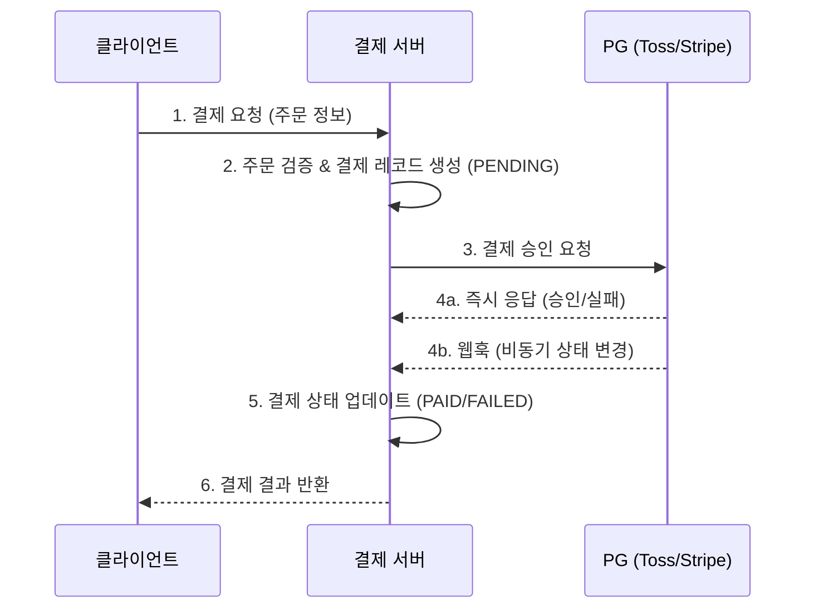
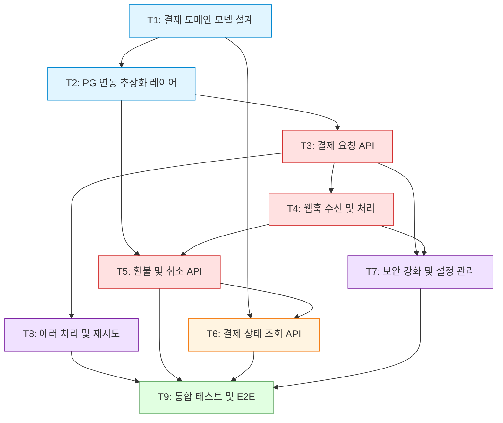

# 결제 시스템 통합 — 실행 계획

> **Planner**: Morpheus (Lead/Architect)
> **요청**: "결제 시스템 통합을 계획하고 실행해줘"
> **작성일**: 2026-04-09
> **상태**: 📋 계획 수립 완료 → Executor 실행 대기

---

## 1. 요구사항 분석

### 1.1 프로젝트 개요

기존 서비스에 **PG(Payment Gateway) 결제 기능**을 통합한다. 사용자가 상품을 선택하고 결제를 완료할 수 있는 엔드투엔드 결제 흐름을 구현하며, 웹훅 기반 비동기 상태 관리와 환불/취소 처리를 포함한다.

### 1.2 핵심 요구사항

| 구분 | 요구사항 | 비고 |
|------|----------|------|
| **PG 연동** | Toss Payments를 주 PG로, Stripe를 해외 결제용으로 연동 | 멀티 PG 구조 |
| **결제 흐름** | 결제 요청 → PG 승인 → 완료/실패 처리 | 클라이언트 → 서버 → PG 3단계 |
| **웹훅 처리** | PG로부터 비동기 결제 상태 알림 수신 및 처리 | 멱등성 보장 필수 |
| **환불/취소** | 전체 환불, 부분 환불, 결제 취소 지원 | 취소 사유 기록 |
| **상태 관리** | 결제 상태 머신 (PENDING → PAID → REFUNDED 등) | 상태 전이 로그 |
| **보안** | API 키 암호화, 서명 검증, PCI DSS 가이드라인 준수 | 카드 정보 비저장 원칙 |

### 1.3 결제 흐름 다이어그램

### 1.4 기술 스택 (가정)

- **백엔드**: Node.js (Express/Fastify)
- **DB**: PostgreSQL
- **ORM**: Prisma
- **테스트**: Jest + Supertest
- **인프라**: Docker, GitHub Actions CI

---

## 2. 태스크 목록

### T1: 결제 도메인 모델 설계

| 항목 | 내용 |
|------|------|
| **설명** | 결제(Payment), 주문(Order), 환불(Refund) 도메인 모델을 설계하고 DB 스키마를 정의한다. 결제 상태 머신(PENDING → PAID → CANCELLED → REFUNDED → FAILED)의 상태 전이 규칙을 명확히 한다. |
| **산출물** | Prisma 스키마 파일, 상태 전이 다이어그램 |
| **완료 기준** | ① Payment, Order, Refund 테이블이 정의되어 있다 ② 결제 상태(PaymentStatus enum)가 5개 이상 정의되어 있다 ③ `prisma migrate dev`가 오류 없이 실행된다 ④ 상태 전이 규칙이 문서화되어 있다 |

### T2: PG 연동 추상화 레이어 구현

| 항목 | 내용 |
|------|------|
| **설명** | Toss Payments와 Stripe를 공통 인터페이스로 추상화하는 PaymentGateway 어댑터 패턴을 구현한다. `PaymentGateway` 인터페이스를 정의하고, `TossPaymentGateway`, `StripePaymentGateway` 구현체를 작성한다. |
| **산출물** | `src/payment/gateways/` 디렉토리, 인터페이스 + 2개 구현체 |
| **완료 기준** | ① `PaymentGateway` 인터페이스에 `requestPayment`, `confirmPayment`, `cancelPayment`, `refundPayment` 메서드가 정의되어 있다 ② Toss, Stripe 각 구현체가 인터페이스를 만족한다 ③ PG 선택이 설정(환경변수)으로 전환 가능하다 ④ 각 구현체의 단위 테스트가 존재하고 통과한다 |

### T3: 결제 요청 API 구현

| 항목 | 내용 |
|------|------|
| **설명** | 클라이언트가 결제를 시작하는 `POST /api/payments` 엔드포인트를 구현한다. 주문 정보 검증, 금액 검증, 결제 레코드 생성(PENDING), PG 결제 요청을 수행한다. |
| **산출물** | API 엔드포인트, 요청/응답 DTO, 유효성 검증 로직 |
| **완료 기준** | ① `POST /api/payments`가 정상 요청에 200을 반환한다 ② 필수 필드 누락 시 400 에러와 명확한 메시지를 반환한다 ③ 결제 레코드가 PENDING 상태로 DB에 생성된다 ④ 금액이 0 이하일 때 요청이 거부된다 ⑤ 통합 테스트가 존재하고 통과한다 |

### T4: 웹훅 수신 및 처리 구현

| 항목 | 내용 |
|------|------|
| **설명** | PG에서 전송하는 웹훅을 수신하는 `POST /api/webhooks/payment` 엔드포인트를 구현한다. 서명 검증, 멱등성 처리(중복 웹훅 무시), 결제 상태 업데이트를 수행한다. |
| **산출물** | 웹훅 엔드포인트, 서명 검증 미들웨어, 멱등성 처리 로직 |
| **완료 기준** | ① 유효한 서명의 웹훅 요청이 정상 처리된다 ② 잘못된 서명의 요청이 401로 거부된다 ③ 동일한 웹훅이 2회 이상 수신되어도 상태가 1회만 변경된다 (멱등성) ④ 웹훅 수신 로그가 DB에 기록된다 ⑤ 처리 실패 시 재시도 큐에 등록된다 |

### T5: 환불 및 취소 API 구현

| 항목 | 내용 |
|------|------|
| **설명** | 전체 환불(`POST /api/payments/:id/refund`), 부분 환불, 결제 취소(`POST /api/payments/:id/cancel`) API를 구현한다. 환불 가능 여부 검증, PG 환불 요청, 환불 레코드 생성을 포함한다. |
| **산출물** | 환불/취소 API 엔드포인트, Refund 레코드 관리 로직 |
| **완료 기준** | ① PAID 상태의 결제만 환불 가능하다 ② 부분 환불 금액이 원 결제 금액을 초과할 수 없다 ③ 누적 환불 금액이 추적된다 ④ 취소 사유가 필수 입력이며 기록된다 ⑤ PG 환불 요청 실패 시 적절한 에러 응답과 롤백이 수행된다 |

### T6: 결제 상태 조회 API 구현

| 항목 | 내용 |
|------|------|
| **설명** | 결제 상태 단건 조회(`GET /api/payments/:id`), 목록 조회(`GET /api/payments`), 상태별 필터링 기능을 구현한다. 결제 상태 이력(히스토리) 조회도 포함한다. |
| **산출물** | 조회 API 엔드포인트, 페이지네이션, 필터링 로직 |
| **완료 기준** | ① 결제 ID로 단건 조회 시 결제 정보와 현재 상태가 반환된다 ② 목록 조회 시 페이지네이션이 동작한다 (기본 20건) ③ 상태별 필터링이 정상 동작한다 ④ 존재하지 않는 ID 조회 시 404를 반환한다 ⑤ 상태 변경 이력이 시간순으로 조회 가능하다 |

### T7: 보안 강화 및 설정 관리

| 항목 | 내용 |
|------|------|
| **설명** | PG API 키를 환경변수/시크릿 매니저로 관리한다. 요청 서명 검증, Rate Limiting, 입력값 새니타이징을 적용한다. PCI DSS 가이드라인에 따라 카드 정보를 서버에 저장하지 않는 구조를 검증한다. |
| **산출물** | 보안 미들웨어, 환경변수 스키마(.env.example), 보안 점검 체크리스트 |
| **완료 기준** | ① PG API 키가 코드에 하드코딩되어 있지 않다 ② `.env.example`에 필요한 환경변수가 문서화되어 있다 ③ 결제 API에 Rate Limiting이 적용되어 있다 (분당 60회) ④ 카드 번호, CVV 등 민감 정보가 서버 로그에 기록되지 않는다 ⑤ 보안 점검 체크리스트가 작성되어 있다 |

### T8: 에러 처리 및 재시도 로직 구현

| 항목 | 내용 |
|------|------|
| **설명** | PG 통신 실패, 타임아웃, 네트워크 오류 등에 대한 에러 처리와 지수 백오프(Exponential Backoff) 기반 재시도 로직을 구현한다. Dead Letter Queue를 통한 최종 실패 관리를 포함한다. |
| **산출물** | 재시도 유틸리티, 에러 핸들링 미들웨어, DLQ 처리 로직 |
| **완료 기준** | ① PG 타임아웃 시 최대 3회 재시도가 수행된다 ② 재시도 간격이 지수 백오프를 따른다 (1s, 2s, 4s) ③ 최종 실패 시 DLQ에 기록되고 알림이 발송된다 ④ 일시적 오류(5xx)와 영구적 오류(4xx)가 구분 처리된다 ⑤ 에러 응답 형식이 통일되어 있다 |

### T9: 통합 테스트 및 E2E 테스트 작성

| 항목 | 내용 |
|------|------|
| **설명** | 전체 결제 흐름(결제 → 승인 → 환불)에 대한 통합 테스트를 작성한다. PG API를 Mock 서버로 대체하여 외부 의존성 없이 테스트 가능하도록 한다. |
| **산출물** | 통합 테스트 스위트, PG Mock 서버, 테스트 시나리오 문서 |
| **완료 기준** | ① 정상 결제 흐름 E2E 테스트가 통과한다 ② 결제 실패 시나리오 테스트가 통과한다 ③ 환불 흐름 테스트가 통과한다 ④ 웹훅 수신 테스트가 통과한다 ⑤ PG Mock 서버로 외부 API 호출 없이 테스트가 실행된다 ⑥ 테스트 커버리지가 80% 이상이다 |

---

## 3. 의존성 그래프

**범례**: 🔵 기반 설계 | 🔴 핵심 결제 로직 | 🟡 조회 | 🟣 횡단 관심사 | 🟢 검증

---

## 4. 실행 순서

의존성을 고려한 위상 정렬(Topological Sort) 결과:

| 순서 | 태스크 | 선행 태스크 | 병렬 실행 가능 |
|------|--------|-------------|----------------|
| 1 | **T1**: 결제 도메인 모델 설계 | 없음 | — |
| 2 | **T2**: PG 연동 추상화 레이어 | T1 | T6과 병렬 가능 |
| 2 | **T6**: 결제 상태 조회 API (기본) | T1 | T2와 병렬 가능 |
| 3 | **T3**: 결제 요청 API | T2 | — |
| 4 | **T4**: 웹훅 수신 및 처리 | T3 | T7, T8과 병렬 가능 |
| 4 | **T7**: 보안 강화 및 설정 관리 | T3, T4 | T8과 병렬 가능 |
| 4 | **T8**: 에러 처리 및 재시도 | T3 | T4, T7과 병렬 가능 |
| 5 | **T5**: 환불 및 취소 API | T2, T4 | — |
| 6 | **T6**: 결제 상태 조회 API (확장) | T5 | — |
| 7 | **T9**: 통합 테스트 및 E2E | T5, T6, T7, T8 | — |

> **참고**: 순서 2에서 T2와 T6는 T1에만 의존하므로 병렬 실행이 가능하다. 순서 4에서 T4, T7, T8도 독립적이므로 병렬 실행이 가능하다. T6는 기본 조회(순서 2)를 먼저 구현하고, T5 완료 후 환불 이력 등 확장 기능(순서 6)을 추가한다.

---

## 5. 위험 요소 및 대응

### Risk 1: PG 연동 API 변경 또는 장애

| 항목 | 내용 |
|------|------|
| **확률** | 🟡 중간 |
| **영향** | 🔴 높음 — 결제 전체 흐름 중단 |
| **대응** | ① 추상화 레이어(T2)를 통해 PG 교체가 용이한 구조 확보 ② PG 장애 시 대체 PG로 자동 전환하는 Fallback 로직 고려 ③ PG Mock 서버(T9)로 외부 의존성 없이 개발/테스트 가능하도록 구성 |

### Risk 2: 웹훅 유실 또는 순서 역전

| 항목 | 내용 |
|------|------|
| **확률** | 🟡 중간 |
| **영향** | 🔴 높음 — 결제 상태 불일치로 인한 정산 오류 |
| **대응** | ① 멱등성 키(Idempotency Key)로 중복 처리 방지 (T4) ② 웹훅 수신 실패 시 PG에 상태를 주기적으로 폴링하는 배치 작업 추가 ③ 상태 전이 규칙(T1)에서 잘못된 전이를 거부하도록 방어 |

### Risk 3: 보안 취약점 노출

| 항목 | 내용 |
|------|------|
| **확률** | 🟢 낮음 (사전 대응 시) |
| **영향** | 🔴 매우 높음 — 결제 정보 유출, 법적 문제 |
| **대응** | ① 카드 정보 비저장 원칙 철저 준수 (PG 토큰화 활용) ② T7을 별도 태스크로 분리하여 보안을 횡단 관심사로 관리 ③ 배포 전 보안 체크리스트 필수 검토 ④ 민감 정보 로깅 차단 검증을 T9 테스트에 포함 |

---

## 6. 참고 사항

- 이 계획은 **Planner(Morpheus)** 가 요구사항을 분석하여 산출한 초기 계획이다
- Executor가 태스크를 실행하고, Validator가 완료 기준을 검증한다
- 검증 실패(Revise) 시 이 계획이 수정되어 재실행된다
- 태스크별 예상 소요 시간은 Executor의 피드백을 반영하여 갱신한다
