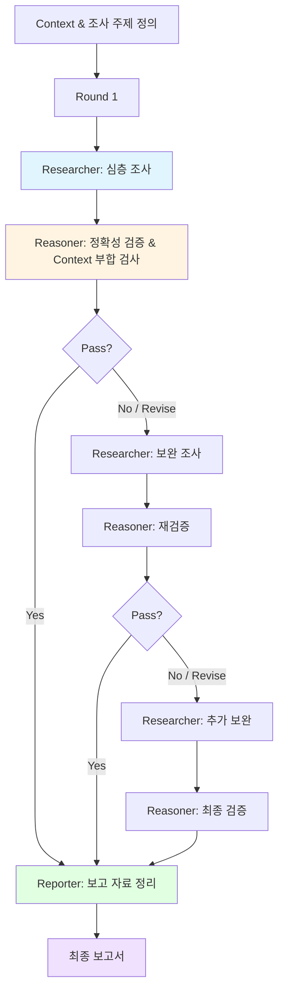

# Research & Report Pattern

> Context 기반 심층 조사와 검증을 거쳐 체계적인 보고 자료를 산출하는 에이전트 협업 패턴

## 패턴 소개

Researcher가 주어진 Context를 이해하고 항목별로 심층 조사를 수행하며, Reasoner가 조사 내용의 정확성과 Context 부합 여부를 검증하고, Reporter가 검증된 내용을 보고용 자료로 체계적으로 정리하는 패턴입니다. 조사→검증→보고의 순환을 통해 정확하고 신뢰할 수 있는 보고서를 산출합니다. 기술 리서치, 시장 조사, 경쟁사 분석, 기술 동향 보고서, 의사결정 지원 자료 작성 등에 적합합니다.

## 에이전트 구성

| 역할 | 설명 |
|------|------|
| **Researcher** | Context를 이해하고 주어진 항목에 대한 심층 조사 수행 |
| **Reasoner** | 조사 내용의 사실 정확성 검증 및 Context 부합 여부 검사 |
| **Reporter** | 검증된 조사 결과를 Context 기반 보고용 자료로 체계적 정리 |

## 파일 셋업

이 패턴을 프로젝트에 적용하려면 아래 파일들을 구성하세요.

### 1. `AGENTS.md` (프로젝트 루트)

루트 AGENTS.md에 전체 에이전트 공통 규칙(Harness)을 정의합니다. 이미 존재하면 그대로 사용하세요.

### 2. `.squad/team.md`

`team.md` 템플릿을 복사하여 `.squad/team.md`로 사용합니다:

```markdown
# Research-Report Team

## Researcher
- 역할: 심층 조사 담당
- 목표: Context를 이해하고 주어진 항목에 대해 깊이 있는 조사 수행

## Reasoner
- 역할: 검증 담당
- 목표: 조사 내용의 사실 정확성과 Context 부합 여부를 비판적으로 검사

## Reporter
- 역할: 보고 자료 정리 담당
- 목표: 검증된 조사 결과를 Context에 맞는 보고용 자료로 체계적 구성
```

### 3. `.squad/routing.md`

```markdown
# Routing: Research → Reason → Report 순환

1. Researcher → Context 분석 및 항목별 심층 조사
2. Reasoner → 조사 내용의 정확성 검증 및 Context 부합 검사
3. Pass → Reporter가 보고 자료 정리
4. Revise → Researcher가 지적 사항 보완 조사 (최대 3 Rounds)
5. Reporter → 검증 완료된 내용을 보고용 자료로 구성
```

## 실행 방법

### Step 1: Squad에 조사 요청

```
Squad, {주제}에 대해 조사하고 보고서 만들어줘
```

### Step 2: Research → Reason → Report 흐름

각 Round는 아래 순서로 진행됩니다:

#### Phase 1: Research (심층 조사)
1. **Researcher** — Context를 분석하여 조사 범위를 정의하고, 항목별로 심층 조사를 수행. 출처와 근거를 명시하며 구조화된 조사 결과를 산출

#### Phase 2: Reason (검증)
2. **Reasoner** — 조사 내용의 사실 정확성을 검증하고, Context에 부합하는지 평가. 논리적 비약·누락·편향이 없는지 비판적으로 검사하여 Pass/Revise 판정

#### Phase 3: Report (보고 자료 정리)
3. **Reporter** — 검증을 통과한 조사 결과를 Context 기반의 보고용 자료로 구성. 핵심 요약, 상세 분석, 결론 및 제언을 포함한 체계적 보고서 산출

### Step 3: 수렴 조건

- Reasoner가 조사 내용의 정확성과 Context 부합을 확인한 경우 (Pass)
- Revise 판정 시 Researcher가 지적 사항을 보완 조사 후 재검증
- 최대 Round(기본 3회)에 도달한 경우

수렴 시 **Reporter**가 최종 보고 자료를 산출합니다.

## 실행 예시 프롬프트

```
Team, LLM 기반 코드 리뷰 도구들을 조사하고 비교 보고서 만들어줘
```

```
Team, 우리 서비스의 경쟁사 현황을 조사하고 분석 보고서 작성해줘
```

```
Team, 2026년 클라우드 네이티브 기술 동향을 리서치하고 요약 보고서 만들어줘
```

```
Team, 마이크로서비스 전환 시 고려사항을 조사하고 의사결정 지원 자료로 정리해줘
```

## 패턴 다이어그램



## 다른 패턴과의 차이점

| | 🔍 Research & Report | ⚔️ Debate & Critic | 🔄 Generator & Evaluator |
|---|---|---|---|
| **목적** | 심층 조사 기반 신뢰할 수 있는 보고서 산출 | 양자 대립적 최선안 도출 | 생성·평가 반복으로 품질 향상 |
| **팀 구성** | Researcher → Reasoner → Reporter | Proposer ↔ Opponent → Critic | Generator → Evaluator → Refiner |
| **핵심 루프** | 조사 → 검증 → 보고 | 제안 → 반론 → 평가 → 종합 | 생성 → 평가 → 개선 |
| **산출물** | 체계적 보고서·분석 자료 | 합의된 결론·권고안 | 품질 기준 충족 산출물 |
| **적합한 작업** | 리서치, 동향 분석, 시장 조사 | 기술 선택, A vs B 비교 | 코드·문서·디자인 생성 |
